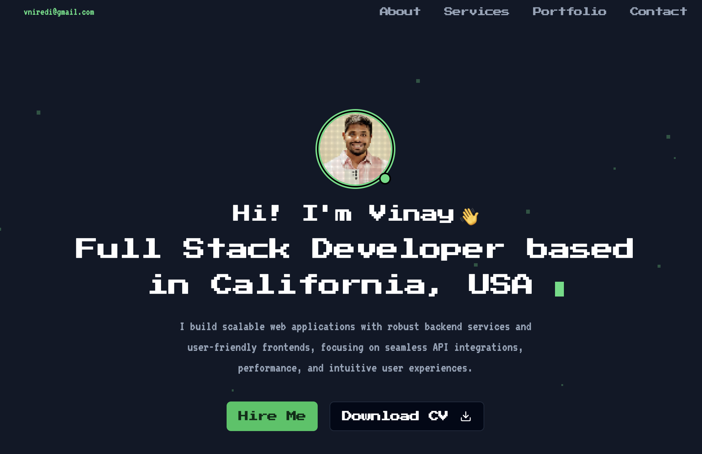

# Retro Pixel Portfolio

A modern, retro-themed portfolio website built with Next.js 14, featuring pixel art aesthetics and interactive elements. View the live demo [www.ivinny.com].



## 🚀 Features

- **Retro Pixel Design**: Unique pixel art aesthetics with modern functionality
- **Responsive Layout**: Fully responsive design that works on all devices
- **Interactive Elements**: 
  - Pixel animation effects
  - Sound effects on interaction
  - Smooth scrolling navigation
- **Dark Mode**: Optimized dark theme for comfortable viewing
- **Contact Integration**: 
  - Email functionality via EmailJS
  - Calendar scheduling via Calendly
- **Performance Optimized**: Built with Next.js 14 for optimal performance and SEO

## 🛠️ Tech Stack

- **Framework**: Next.js 14 (App Router)
- **Styling**: Tailwind CSS
- **Typography**: 
  - Press Start 2P (Primary)
  - VT323 (Secondary)
- **Animations**: Custom CSS animations
- **Integrations**:
  - EmailJS for contact form
  - Calendly for scheduling
- **Deployment**: Vercel

## 🚦 Getting Started

### Prerequisites

- Node.js 18.17 or later
- npm or yarn

### Installation

1. Clone the repository:

git clone https://github.com/your-username/retro-pixel-portfolio.git
cd retro-pixel-portfolio


2. Install dependencies:

npm install

3. Create a `.env.local` file in the root directory and add your environment variables:

```bash
NEXT_PUBLIC_EMAILJS_SERVICE_ID=your_service_id
NEXT_PUBLIC_EMAILJS_TEMPLATE_ID=your_template_id
NEXT_PUBLIC_EMAILJS_PUBLIC_KEY=your_public_key
NEXT_PUBLIC_CALENDLY_URL=your_calendly_url
```

4. Start the development server:

npm run dev


5. Open [http://localhost:3000](http://localhost:3000) in your browser.

### Building for Production
npm run build
npm start


## 📁 Project Structure

```bash
retro-pixel-portfolio/
├── app/ # Next.js app directory
│   ├── components/ # React components
│   ├── hooks/ # Custom React hooks
│   ├── lib/ # Utility functions
│   └── page.tsx # Home page
├── public/ # Static assets
└── styles/ # Global styles
```


## 🎨 Customization

1. **Colors**: Edit the Tailwind configuration in `tailwind.config.js`
2. **Typography**: Update fonts in `app/layout.tsx`
3. **Content**: Modify content in respective components under `app/components/`
4. **Styling**: Adjust global styles in `app/globals.css`

## 🔧 Environment Variables

Required environment variables:

- `NEXT_PUBLIC_EMAILJS_SERVICE_ID`: EmailJS service ID
- `NEXT_PUBLIC_EMAILJS_TEMPLATE_ID`: EmailJS template ID
- `NEXT_PUBLIC_EMAILJS_PUBLIC_KEY`: EmailJS public key
- `NEXT_PUBLIC_CALENDLY_URL`: Your Calendly scheduling URL

## 🤝 Contributing

Contributions are welcome! Please feel free to submit a Pull Request.

1. Fork the repository
2. Create your feature branch (`git checkout -b feature/AmazingFeature`)
3. Commit your changes (`git commit -m 'Add some AmazingFeature'`)
4. Push to the branch (`git push origin feature/AmazingFeature`)
5. Open a Pull Request

## 📄 License

This project is licensed under the MIT License - see the [LICENSE.md](LICENSE.md) file for details.

## 👏 Acknowledgments

- Font families from Google Fonts (Press Start 2P, VT323)
- Icons from Lucide Icons
- UI components inspired by shadcn/ui
- Sound effects and pixel animations

## 📧 Contact

Vinay - vniredi@gmail.com

Project Link: [https://github.com/vakkisan/retro-pixel-portfolio](https://github.com/vakkisan/retro-pixel-portfolio)
